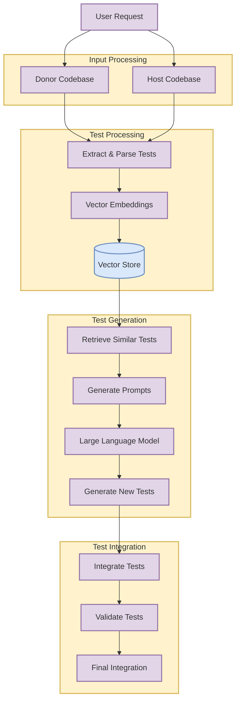

# Retrieval Augmented Generation (RAG) Pipeline

## Pipeline Diagram

```mermaid
graph TD
    classDef process fill:#e1d5e7,stroke:#9673a6,stroke-width:2px
    classDef database fill:#dae8fc,stroke:#6c8ebf,stroke-width:2px
    classDef subgraph_style fill:#fff2cc,stroke:#d6b656,stroke-width:2px

    U[User Request]:::process

    subgraph Input[Input Processing]
        D[Donor Codebase]:::process
        H[Host Codebase]:::process
    end

    subgraph Processing[Test Processing]
        E[Extract & Parse Tests]:::process
        V[Vector Embeddings]:::process
        DB[(Vector Store)]:::database
    end

    subgraph Generation[Test Generation]
        R[Retrieve Similar Tests]:::process
        P[Generate Prompts]:::process
        LLM[Large Language Model]:::process
        G[Generate New Tests]:::process
    end

    subgraph Validation[Test Integration]
        I[Integrate Tests]:::process
        T[Validate Tests]:::process
        F[Final Integration]:::process
    end

    U --> D & H
    D & H --> E
    E --> V
    V --> DB
    DB --> R
    R --> P
    P --> LLM
    LLM --> G
    G --> I
    I --> T
    T --> F

    style Input fill:#fff2cc,stroke:#d6b656,stroke-width:2px
    style Processing fill:#fff2cc,stroke:#d6b656,stroke-width:2px
    style Generation fill:#fff2cc,stroke:#d6b656,stroke-width:2px
    style Validation fill:#fff2cc,stroke:#d6b656,stroke-width:2px
```
