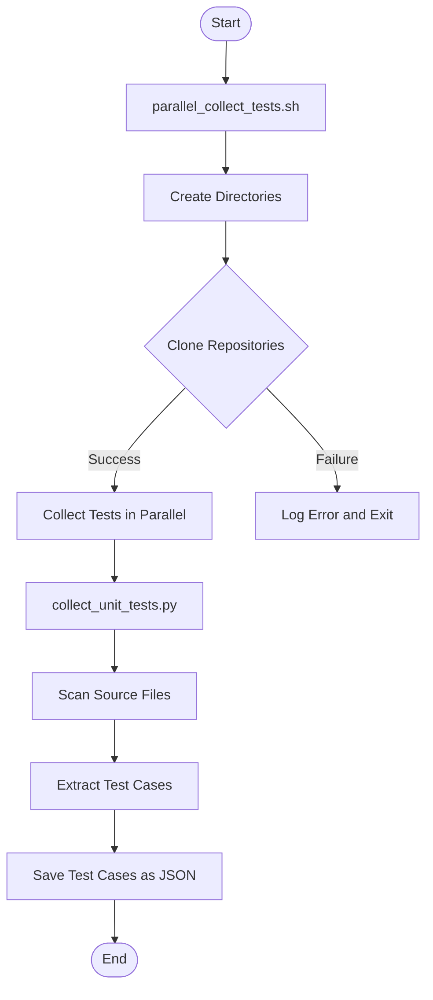
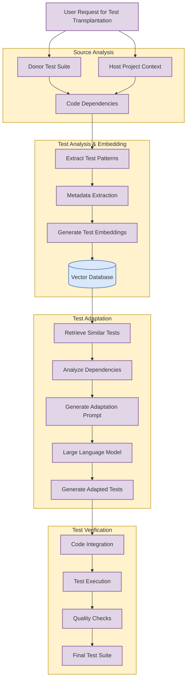

# Retrieval Augmented Generation (RAG) Pipeline

## Test Collection

```mermaid
flowchart TD
    Start([Start]) --> A[parallel_collect_tests.sh]
    A --> B[Create Directories]
    B --> C{Clone Repositories}
    C -->|Success| D[Collect Tests in Parallel]
    C -->|Failure| E[Log Error and Exit]
    D --> F[collect_unit_tests.py]
    F --> G[Scan Source Files]
    G --> H[Extract Test Cases]
    H --> I[Save Test Cases as JSON]
    I --> End([End])
```

## Transplantation Pipeline Diagram

```mermaid
graph TD
    classDef process fill:#e1d5e7,stroke:#9673a6,stroke-width:2px
    classDef database fill:#dae8fc,stroke:#6c8ebf,stroke-width:2px
    classDef subgraph_style fill:#fff2cc,stroke:#d6b656,stroke-width:2px

    U[User Request for Test Transplantation]:::process

    subgraph Input[Source Analysis]
        D[Donor Test Suite]:::process
        H[Host Project Context]:::process
        C[Code Dependencies]:::process
    end

    subgraph Processing[Test Analysis & Embedding]
        E[Extract Test Patterns]:::process
        M[Metadata Extraction]:::process
        V[Generate Test Embeddings]:::process
        DB[(Vector Database)]:::database
    end

    subgraph Generation[Test Adaptation]
        R[Retrieve Similar Tests]:::process
        A[Analyze Dependencies]:::process
        P[Generate Adaptation Prompt]:::process
        LLM[Large Language Model]:::process
        G[Generate Adapted Tests]:::process
    end

    subgraph Validation[Test Verification]
        I[Code Integration]:::process
        T[Test Execution]:::process
        Q[Quality Checks]:::process
        F[Final Test Suite]:::process
    end

    U --> D & H
    D & H --> C
    C --> E
    E --> M
    M --> V
    V --> DB
    DB --> R
    R --> A
    A --> P
    P --> LLM
    LLM --> G
    G --> I
    I --> T
    T --> Q
    Q --> F

    style Input fill:#fff2cc,stroke:#d6b656,stroke-width:2px
    style Processing fill:#fff2cc,stroke:#d6b656,stroke-width:2px
    style Generation fill:#fff2cc,stroke:#d6b656,stroke-width:2px
    style Validation fill:#fff2cc,stroke:#d6b656,stroke-width:2px
```
